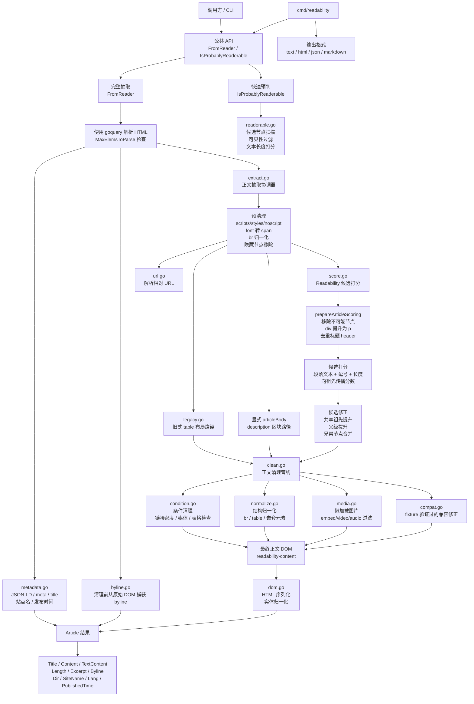
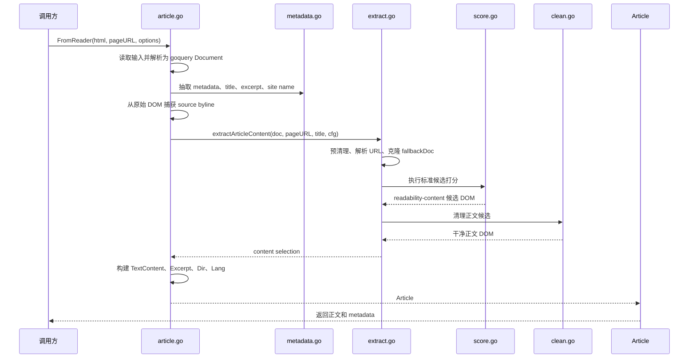

# readability.go

[English README](README.md)

`readability.go` 是 Mozilla Readability 的 Go 实现，目标是在 fixture 级别兼容 [`mozilla/readability`](https://github.com/mozilla/readability) 的行为。

## 状态

这个项目目前处在兼容性移植阶段。

- Mozilla `test/test-pages` fixtures 已复制到 `testdata/test-pages`。
- upstream fixture 来源固定记录在 `testdata/UPSTREAM`。
- 所有已固定 Mozilla fixtures 的 metadata 和 content 对比都已接入测试。
- 可通过下面的命令运行完整兼容性测试：

```sh
READABILITY_FULL_COMPAT=1 go test -cover -count=1 -run 'TestParseAllMozilla(Metadata|Content)Fixtures'
```

实现保持自包含，不依赖其他 Go Readability 移植版本。当前工作重点是用通用 Readability 启发式规则通过 upstream fixtures，而不是把特定 fixture 硬编码进生产逻辑。

## 开发

- 运行 `make all` 执行默认质量门禁。
- 运行 `make test` 执行默认测试套件、race detector、覆盖率摘要，以及完整 Mozilla 兼容性差异报告。
- 运行 `make vet` 执行静态检查。

## 当前 Upstream 差异

`tools/compare-upstream.mjs` 会将当前实现与最新 Mozilla Readability checkout 对比。有些差异会被有意保留，因为追随当前 upstream 可能破坏已固定 fixtures，或需要引入站点特定行为。机器可读的允许列表位于 `tools/known-upstream-drift.json`。传入 `--known-drift` 后，对比工具只允许这些已记录差异，同时仍会在出现新差异时失败：

```sh
node tools/compare-upstream.mjs --all --char-threshold 1 --known-drift
```

只有在确认差异不是通用解析 bug，并记录为什么匹配当前 upstream 反而不适合这个移植版本或会破坏已固定 fixture 后，才应新增或修改 known drift 条目。

- `firefox-nightly-blog` 和 `medicalnewstoday`：当前 upstream 会选中 newsletter 或 print-message 区块，而已固定 fixtures 和本移植版本保留正文。
- `hukumusume`：当前 upstream 返回更短的旧式 table 抽取结果；已固定 fixture 保留更宽的旧式 table 内容。
- `lifehacker-post-comment-load` 和 `lifehacker-working`：剩余差异是 `textContent` 在块边界附近的空白。全局改写 text-content 会回归许多其他 fixtures，因此应等待 parser 级空白模型，而不是做 fixture 特定捷径。
- `wikipedia`：当前 upstream 会序列化第一个 infobox，且不带 parser 插入的 `<tbody>`。许多已固定 fixtures 包含显式 `<tbody>`，因此在修改序列化前，需要区分隐式与显式 table section。
- `cnn`：当前 upstream 保留外层 `smartassetcontainer`（只含 "Powered by SmartAsset.com" 归因段落），同时剥离嵌套 iframe/script payload。本移植版本的 embed cleanup 会移除整个子树。经过限时评估后，这个差异被有意保留，因为复制 upstream 行为需要站点特定的 attribution-bearing embed wrapper 启发式规则，可能让其他 widget/embed fixtures 回归。

## 项目定位

这个移植版本刻意优化的是**与已固定 mozilla/readability checkout 的 fixture 级兼容性**，而不是激进追随 upstream HEAD，或与其他 Go 移植版本逐字节一致。具体影响如下：

- 130 个 Mozilla `test/test-pages` fixtures 是回归测试套件。任何变更都必须保持它们通过；与当前 upstream 的差异如果会破坏已固定 fixture，会记录在 `tools/known-upstream-drift.json`，而不是盲目追随。
- 来自单个 fixture 的兼容行为（CMS 特例、新闻站模板等）放在 `compat.go` / `legacy.go`，并刻意与通用 parser 流程隔离，避免泄漏到其他路径。
- 不依赖其他 Go Readability 移植版本。算法从 upstream 源码重新实现，因此行为差异是有意且有记录的，而不是继承来的。

如果你需要一个积极追随 upstream HEAD 的移植版本，或一个在 upstream 之上加入额外启发式规则的版本，这个项目不是那个方向。如果你需要基于已知 mozilla/readability 快照、行为可预测且有机器可检查 drift 报告的实现，这个项目更合适。

## 实现布局

公共入口位于 `article.go`。Parser 实现按职责拆分：

- `extract.go` 协调正文抽取和 fallback 选择。
- `score.go` 为正文候选打分，并构建最终内容树。
- `clean.go`、`condition.go`、`normalize.go` 和 `media.go` 清理并归一化已抽取内容。
- `compat.go` 和 `legacy.go` 存放由 fixture 验证过的兼容行为，并刻意与通用 parser 流程分离。
- `metadata.go`、`excerpt.go` 和 `byline.go` 抽取文档 metadata。
- `dom.go` 和 `url.go` 提供 parser 各处复用的 DOM 与 URL helper。

### 架构





## 使用

### CLI

`cmd/readability` 命令可以从 URL、HTML 文件或 stdin 中抽取可读正文：

```sh
go run ./cmd/readability https://example.com/post
go run ./cmd/readability article.html --url https://example.com/post --format json
cat article.html | go run ./cmd/readability - --url https://example.com/post --format md --metadata
```

支持的输出格式包括 `text`（默认）、`html`、`json` 和 `markdown` / `md`。Markdown 输出面向 GitHub Flavored Markdown，`--metadata` 会为 Markdown 输出添加 YAML front matter。

### 库

```go
package main

import (
	"fmt"
	"log"
	"os"

	readability "github.com/miclle/readability.go"
)

func main() {
	f, err := os.Open("article.html")
	if err != nil {
		log.Fatal(err)
	}
	defer f.Close()

	article, err := readability.FromReader(f, "https://example.com/article", nil)
	if err != nil {
		log.Fatal(err)
	}

	fmt.Println(article.Title)
	fmt.Println(article.TextContent)
}
```

### 选项

`FromReader` 接受可选的 `*Options`，用于对应 upstream parser 的配置开关：

```go
opts := &readability.Options{
	CharThreshold:       500,                                    // skip docs shorter than 500 chars
	ClassesToPreserve:   []string{"caption", "highlight"},      // extra classes kept during cleanup
	KeepClasses:         false,                                  // true keeps every class attribute
	NbTopCandidates:     5,                                      // candidate pool size during scoring
	DisableJSONLD:       false,                                  // skip JSON-LD metadata extraction
	AllowedVideoRegex:   nil,                                    // override built-in video allow list
	MaxElemsToParse:     0,                                      // > 0 aborts on huge documents with ErrTooManyElements
	LinkDensityModifier: 0,                                      // shifts conditional-cleanup link-density thresholds (positive = looser)
}
article, err := readability.FromReader(f, pageURL, opts)
```

当 `MaxElemsToParse` 被超过时，调用会返回 `readability.ErrTooManyElements`。当抽取文本短于 `CharThreshold` 时，调用会返回 `readability.ErrBelowCharThreshold`，同时返回零值 `Article`。可使用 `errors.Is` 将这些情况与其他失败区分开。

### Readerability 预判

如果只需要快速预判，而不是执行完整抽取流程：

```go
ok, err := readability.IsProbablyReaderable(f)
if err != nil {
	log.Fatal(err)
}
if !ok {
	return
}
```

`IsProbablyReaderable` 接受可选的 `ReaderableOptions`，可调整 `MinContentLength` 和 `MinScore`。

## Benchmark

Benchmark 套件覆盖 small / medium / large / visibility-heavy fixtures，位于 `bench_test.go`：

```sh
make bench                       # quick run, no baseline write
make bench-baseline              # refresh testdata/bench-baseline.txt (6 samples)
make bench-compare               # benchstat current vs committed baseline
```

`testdata/bench-baseline.txt` 是在维护者机器上采集的结果（Apple M4 Pro，darwin/arm64），只用于本地开发参考。CI 使用动态 baseline：`bench-compare` job 会在同一 runner 上分别记录 `origin/main` 和 PR head，并将 `benchstat` 报告作为构建产物上传。这可以抵消 CPU、调度器和 Go 版本差异带来的波动。

回归门禁 `tools/bench-regression-gate.sh` 会解析 benchstat CSV 输出。当某个 benchmark 回归至少 10%，并且 benchstat 标记该变化具有统计显著性（p < 0.05）时，门禁会失败。性能改进和噪声（`~`）会被忽略。这个阈值有意设置得较宽，因为 GitHub-hosted runners 波动较大，过紧阈值通常比真实回归更容易产生误报；如果你的 fork 有专用 runner，可在 `.github/workflows/ci.yml` 中调整。

也可以直接运行 `go test` 做临时 benchmark：

```sh
go test -bench=. -benchmem -benchtime=2s -run=^$
```

## Fuzzing

`fuzz_test.go` 为 `FromReader` 和 `IsProbablyReaderable` 都定义了 fuzz harness。它们会检查任意 HTML 字节序列不会触发 panic 或意外的非哨兵错误：

```sh
go test -run=^$ -fuzz=FuzzFromReader -fuzztime=30s .
go test -run=^$ -fuzz=FuzzIsProbablyReaderable -fuzztime=30s .
```

在发布涉及解析、清理或可见性逻辑的变更前，建议在 CI 或本地运行这些 fuzz 测试。

## Upstream 测试数据

`testdata/test-pages` 下的兼容性 fixtures 复制自 Mozilla Readability，遵循 Apache License, Version 2.0。来源与版权信息见 `NOTICE` 和 `testdata/UPSTREAM`。

## 文档位置

README 文件保留在仓库根目录更合适，因为 GitHub 会直接把根目录 `README.md` 作为项目首页展示，`README_zh.md` 也能从首页被发现。`.github` 目录更适合放 GitHub Actions workflow、Issue/PR 模板、CODEOWNERS、安全策略或组织级默认社区文件；除非这些文档只服务 GitHub 平台流程，否则不建议把项目 README 移到 `.github`。

## License

Apache License 2.0。
